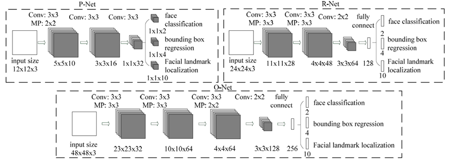
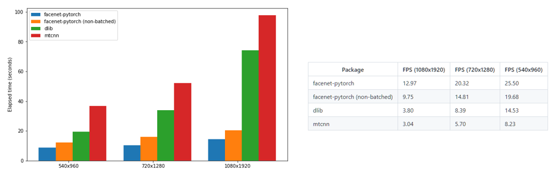
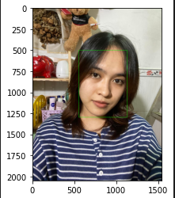
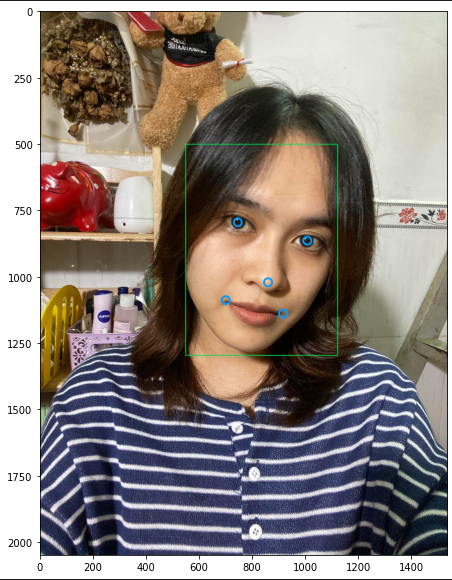
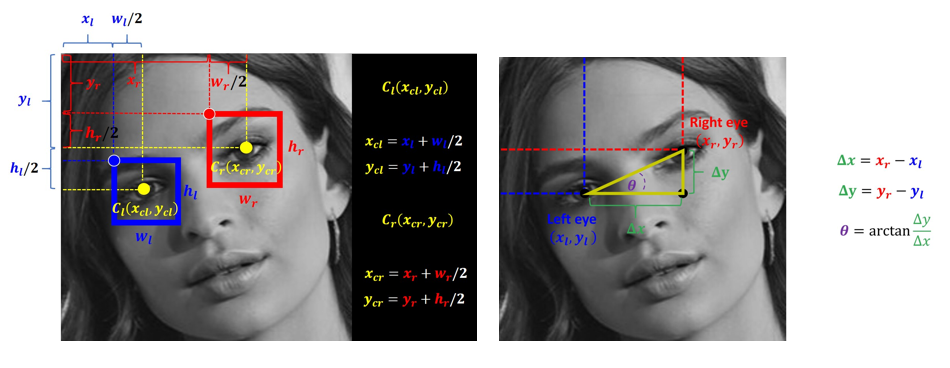
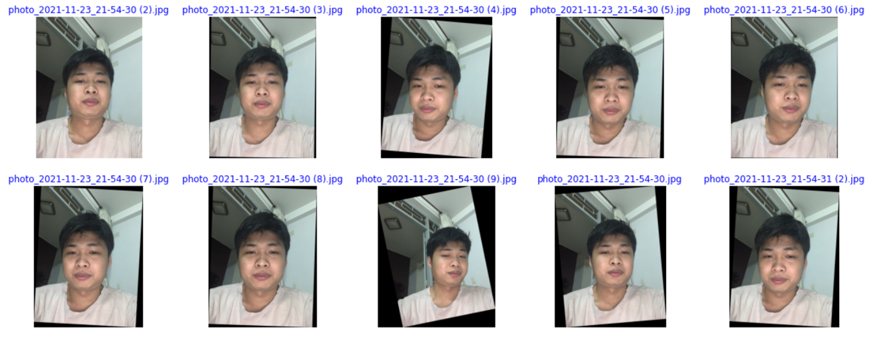
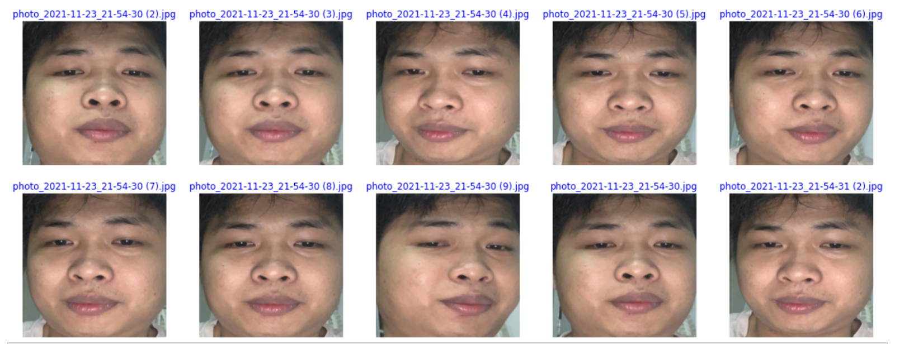
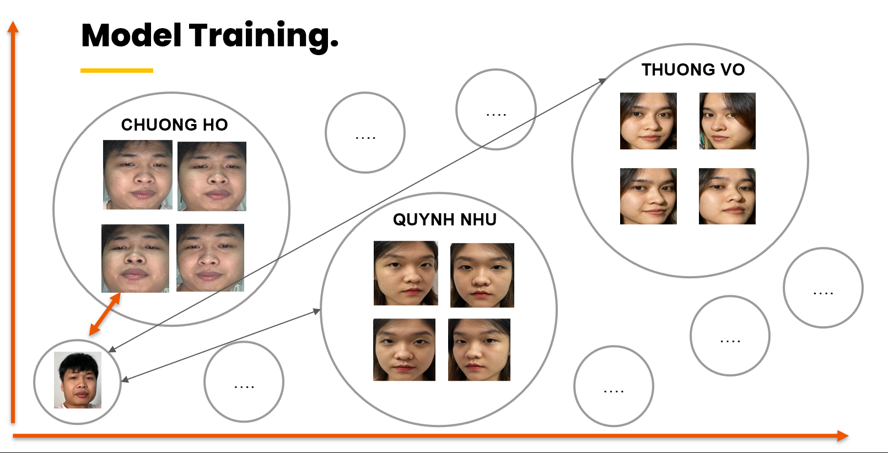
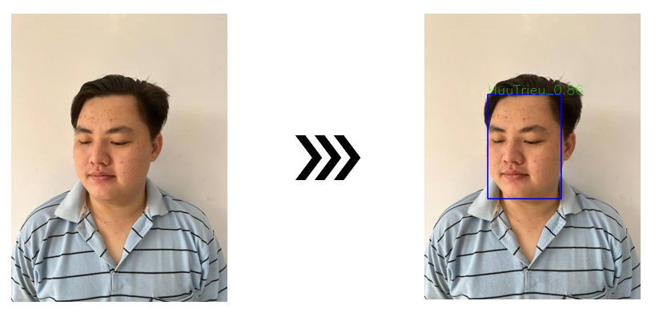

### Face Recognition

Face Recognition use both mtcnn and pytorch to work, pretrained model VGGFace2 with output logit vectors of length 8631.

#### Installer 

Install some package first : 

``` shell
pip install -r requirements.txt
```

#### Structural

```
src
├── photos_aligned
│   ├── Aligned Images : Face Align
│   │   ├── People 1
│   │   └── People 2
│   ├── Cropped_Images : Face Crop
│   │   ├── People 1
│   │   └── People 2
├── photos_database: folder save image after predict
├── photos_new:  new image need train
├── photos_origin : folder photo origin
├── result : folder save result predict
├── test : image predict
├── Documents : Presentation
├── align-crop-resize-save-images-using-mtcnn.ipynb : crop image , align image use mtcnn
├── Demo_MtNCN.ipynb : Demo mtcnn
├── data.pt : Train model
├── requirements.txt : package requirements
├── StreamDemo.py : demo app
├── UpdateAndPredictFace.ipynb : train model, add image, save image predict

```

#### Step to train and predict face

- add new image to  photos_new.

- Run Jupyter NoteBook `align-crop-resize-save-images-using-mtcnn.ipynb` moved image to folder  photos_origin and auto create two new location :
    - Photos_aligned/Aligned Images
    - Photos_aligned/Cropped_Images
- Run `UpdateAndPredictFace.ipynb` to train model from Photos_aligned/Aligned Images and predict, after predict, image align will be move to photos_database for save database and make empty folder, use for add new people in next step

- folder Test : all image test

- folder result : result image after predict

### Material





### Get Face 



### Face Landmark



#### Align Face 

Algorithm



Result



#### Crop Face



#### Compare Face



### Predict Face



#### Demo:

- <a href="https://share.streamlit.io/chuongmep/live_face_recognition/StreamDemo.py" target="_blank">Face Recognition Streamlit</a> 


####  Reference
- <a href="https://github.com/timesler/facenet-pytorch" target="_blank">https://github.com/timesler/facenet-pytorch</a> 

- <a href="https://docs.streamlit.io/" target="_blank">https://docs.streamlit.io/</a> 

- <a href="https://github.com/ipazc/mtcnn" target="_blank">https://github.com/ipazc/mtcnn</a> 

- <a href="https://github.com/maziarraissi/Applied-Deep-Learning" target="_blank">https://github.com/maziarraissi/Applied-Deep-Learning</a> 

- <a href="https://github.com/davidsandberg/facenet" target="_blank">https://github.com/davidsandberg/facenet</a> 


